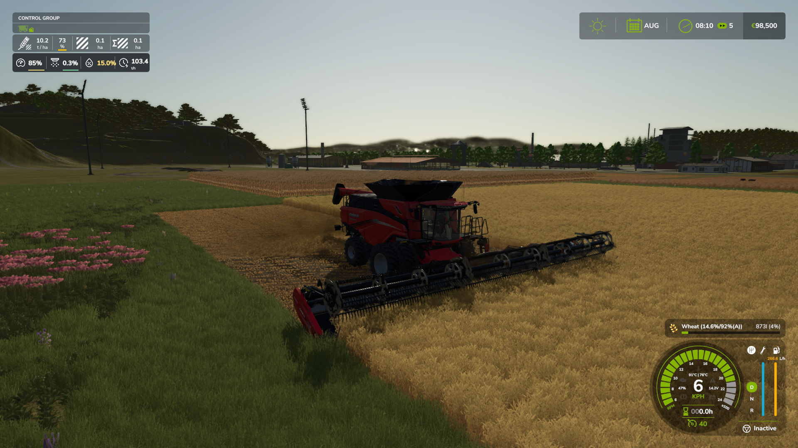
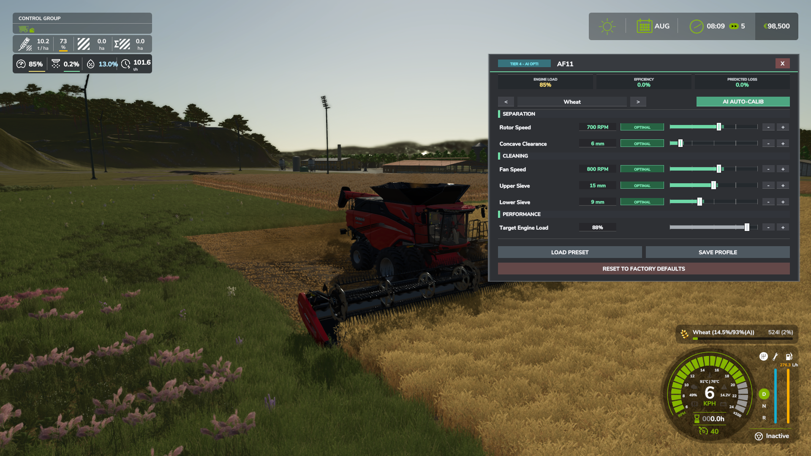
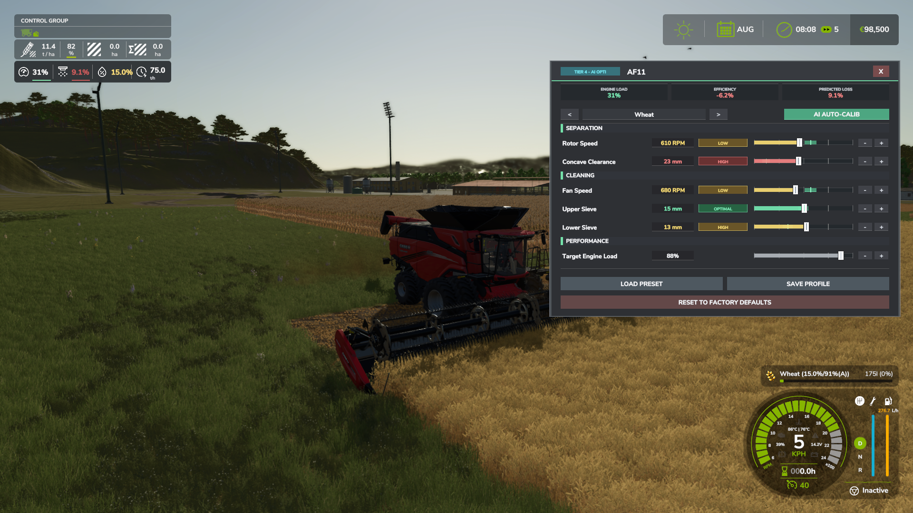

# Realistic Harvesting — Farming Simulator 25

> **Your combine now behaves like a real machine. Push it too hard — and you'll pay the price.**

---

## 📥 Download

**[kingmod.net by exekx](https://www.kingmods.net/en/fs25/mods/73932/realistic-harvesting)**

> Please do not re-upload or redistribute without permission.

---

## What Does This Mod Do?

In vanilla FS25, you can drive at full speed through any crop density with no consequences. **Realistic Harvesting** changes that completely.

Your combine now features a **first-principles physical power-balance load engine** that responds realistically to:
- **Mass Flow & Crop Density** (live tons per hour based on field yield, cut width, and forward speed)
- **Crop Specific Energy ($E_{spec}$)** (physically calibrated for grains, oilseeds, pulses, corn, roots, forage, and cotton)
- **Header Dimensions & Drag** (dynamic cutterbar friction queried directly from store data)
- **Terrain Slope & Soil Resistance** (working uphill and on soft ground increases engine load)
- **Mechanical Calibration** (fan speed, rotor RPM, upper/lower sieves, concave clearance / feeder intake)
- **Swathing / Windrow Pickup** (automatically detected, eliminating cutterbar drag and computing windrow intake)
- **Machine Type** (grain combines, forage harvesters, root harvesters, cotton pickers, and modular platforms like NEXAT)
- **Precision Farming (PF) & Custom Maps** (native dynamic yield scaling across variable soil types, nitrogen zones, and cushioned field-edge entry smoothing)
- **Crop Moisture** (optional seamless integration with the `FS25_MoistureSystem` mod)

Drive too fast or overload your separator → engine overloads → you lose grain. Simple and authentic.

---

## Quick Start — Your First 5 Minutes

**You don't need to do anything complicated to start.** The mod works automatically out of the box.

1. Enter your combine and begin harvesting normally.
2. The **HUD panel** appears on screen displaying live telemetry.
3. Watch the **Engine Load** bar — keep it in the green/yellow zone (below 80–90%).
4. If Engine Load exceeds 80%, **crop losses begin** (and climb steeply above 100%). Slow down or follow the **Recommended Speed**.
5. Press **Right Shift + K** at any time to inspect your combine settings and calibrate for the crop.

That's it for the basics. Everything else is optional depth.

---

## The HUD — Reading Your Data

The HUD appears automatically when you enter a combine. Right-click to enable cursor mode and drag the HUD anywhere on screen.

| Indicator | What It Means |
|:---|:---|
| **Engine Load %** | Current machine load. Safe under 80% (green), warning 80–95% (yellow), critical overload >95% (red). |
| **Productivity** | Live processing rate in tons/hour (`t/h`, `ton/h`), bushels/hour (`bu/h`), or volume (`L/h`). |
| **Yield** | Live crop yield (`t/ha`, `ton/ac`, or `bu/ac`) sampled in real time from the cut field area. |
| **Speed / Rec.** | Your current forward speed vs. the recommended safe speed limit calculated by the mod. |
| **Loss** | Live crop loss percentage and status level: **LOW** / **MED** / **HIGH**. |
| **Moisture %** | Live crop moisture content (displayed with Tier 3+ electronics when the Moisture System mod is active). |

- **Color Code:** Green = optimal, Yellow = caution / elevated load, Red = overload / active crop loss.
- **Units System:** Switch seamlessly between **Metric** (km/h, t/ha, t/h), **Imperial** (mph, ton/ac, ton/h), and **Bushels** (mph, bu/ac, bu/h) in `ESC → Settings → Realistic Harvesting`. HUD position and metric toggles are saved per player.

---

## Crop Loss — How It Works

Losses happen dynamically from three potential sources:

### 1. Engine Overloading (Speed & Mass Flow)
The mod calculates losses using a realistic progressive overload curve starting at **80% Engine Load**:
- **0% to 80% Load:** Safe operating zone — **0.0% crop loss**.
- **80% to 100% Load:** Progressive capacity boundary — small progressive loss (~0% to 2.0%).
- **100% to 110% Load:** High throughput territory — acceptable operational loss (~2.0% to 4.5%).
- **Above 110% Load:** Severe overloading — threshing drum and cleaning shoes choke, causing steep exponential losses (up to 50% max).

Loss severity scales according to your selected **Crop Loss Severity** setting (Arcade: 0.5x, Normal: 1.0x, Realistic: 2.0x).

*High losses — combine pushed past capacity*

*Optimal speed — minimal losses*

### 2. Sub-Optimal Calibration (Machine Settings)
If your machine's settings do not match the harvested crop, you incur additional efficiency and loss penalties:

- **1. Efficiency (Rotor / Feeder / Concave):**
  These components pull crop into the machine and thresh it. Poor adjustment forces the engine to work harder, reducing ground speed. Perfect settings grant up to a **+5.0% Speed Bonus** and an **Overload Shield** that absorbs momentary yield spikes.
- **2. Cleaning Shoe Loss (Fan & Sieves):**
  These components separate grain from chaff. If the fan is too fast or sieves are badly set, clean grain gets blown out the back. Perfect settings ensure **0% Added Crop Loss**.
- **Forage Harvesters:**
  Silage choppers deliver all chopped material into the trailer (no grain loss), but incorrect drum or feed roll speeds severely penalize engine efficiency and throughput.

### 3. Crop Moisture Penalties
When the `FS25_MoistureSystem` mod is detected, harvesting in damp weather or wet crops increases engine threshing resistance and induces wet crop separation losses.

---

## Difficulty & Mod Settings

Open: **ESC → Settings → Realistic Harvesting**

### Game & Server Settings (Admin-Controlled in MP)
| Setting | Options | Description |
|:---|:---:|:---|
| **Engine Power** | Arcade (200%) / Normal (120%) / Realistic (100%) | Scales combine engine processing capacity |
| **Crop Loss Severity** | Arcade (50%) / Normal (100%) / Realistic (200%) | Multiplier applied to overload and calibration crop losses |
| **Speed Limiter** | ON / OFF | Automatically regulates cruise control to keep engine load safe |
| **Crop Loss System** | ON / OFF | Enables or disables grain loss simulation entirely |
| **Moisture Integration** | ON / OFF | Enables dynamic moisture load penalties (when Moisture System is installed) |

### Client / Visuals Settings (Personal per Player)
| Setting | Description |
|:---|:---|
| **Show HUD** | Master toggle for the draggable HUD panel |
| **HUD Metric Toggles** | Individually toggle Yield, Load, Speed, Productivity, Loss, Moisture, and Load Warnings |
| **Measurement Units** | Choose between **Metric** (km/h, t/ha), **Imperial** (mph, ton/ac), and **Bushels** (mph, bu/ac) |

**Multiplayer:** Gameplay settings are synchronized from the server, while HUD positioning, visibility toggles, and measurement units are stored individually for each player.

---

## RHM Electronics — Upgrade Packages

When purchasing or leasing a combine in the shop, choose an **RHM Electronics** package to match your career progression:

| Tier | Package Name | Price | Features & Operation |
|:---:|:---|:---:|:---|
| **1** | **Standard** | Free | Base engine load physics & speed limiting. Factory mechanical baseline variance (~50% ± 8%). Strictly manual control. |
| **2** | **Sensor Kit** | $3,500 | Adds live Yield (t/ha), Productivity (t/h), and green optimal target zone markers on calibration sliders. Strictly manual control. |
| **3** | **Yield & Loss Monitor** | $8,500 | Adds real-time Crop Loss telemetry, live Moisture tracking (with Moisture System mod), and detailed field statistics. Strictly manual control. |
| **4** | **Opti-Harvest AI** | $15,000 | Interactive AI calibration — samples incoming crop stream to calculate physical optimums and applies live continuous background auto-trimming. |

---

## Combine Calibration (Advanced)

Press **Right Shift + K** while in a combine to open the interactive Calibration Menu.

*Well-calibrated — low loss, high efficiency*

*Poorly calibrated — high loss penalty*

### Operating Modes & Progression

| Feature | Tiers 1–3 (Standard / Sensor / Monitor) | Tier 4 (Opti-Harvest AI) |
|:---|:---|:---|
| **Operating Mode** | Strictly **MANUAL** | Starts in **MANUAL**, unlocks **AUTO** button |
| **On Machine Purchase** | Factory baseline variance (~50% ± 8%) | Factory baseline variance (~50% ± 8%) |
| **Field Tuning** | Operator manually tunes sliders using field experience or Tier 2/3 target markers | Harvest a few meters, open Shift+K, and press **AUTO** for instant physical calibration |
| **Dynamic Trimming** | Static until operator adjusts sliders or loads a profile | Continuously micro-adjusts in background for field moisture and density shifts |
| **Custom Profiles** | Create, save, and load custom profiles per crop | Save custom profiles or re-calibrate on the fly with AUTO |

> **Interactive AI Calibration:** Harvesters no longer magically auto-tune themselves behind the scenes. On Tier 4, enter the field, cut a short strip to gather live crop telemetry, open Shift+K, and click **AUTO** to let Opti-Harvest AI dial in zero-loss perfection.

### 🎯 Target Engine Load (Auto-Throttling Cruise Control)

Inside the Calibration Menu (**Right Shift + K**), you can dial in your machine's **Target Engine Load** (default: **88%**, adjustable from 70% to 95%):

- **Conservative (75–82%):** Maximum yield protection and zero loss. Ideal buffer for hilly terrain, uneven fields, or dense weed patches.
- **Balanced (85–90%):** Standard sweet spot. Maximizes field throughput while staying safely below the critical overload threshold.
- **Aggressive (91–95%):** High-speed operation for operators seeking maximum hectares per hour, accepting occasional light loss spikes.

When the **Speed Limiter** is enabled, it dynamically adjusts cruise control to hover smoothly around this target load, featuring an intelligent deadzone that prevents throttle surging.

---

## Supported Machine Types & Reference Settings

Optimal settings are calculated dynamically by the mod's ASABE/FS25 physics engine based on bulk density, seed geometry, and live field moisture. The tables below show standard reference operating ranges:

### 🌾 Grain Combines — 5 Parameters
*(Fan Speed · Rotor Speed · Upper Sieve · Lower Sieve · Concave Clearance)*

- **SEPARATION** (Rotor Speed, Concave Clearance) — affects throughput capacity and engine load
- **CLEANING** (Fan Speed, Upper Sieve, Lower Sieve) — affects cleaning shoe grain loss

| Crop | Fan Speed (RPM) | Rotor Speed (RPM) | Upper Sieve (mm) | Lower Sieve (mm) | Concave Clearance (mm) |
|:---|:---:|:---:|:---:|:---:|:---:|
| **Wheat / Barley** | 940–1070 | 870–970 | 15–18 | 10–13 | 4–8 |
| **Oat** | 940–1070 | 820–930 | 18–21 | 12–15 | 5–9 |
| **Corn (Maize)** | 1070–1180 | 470–560 | 21–24 | 15–18 | 25–35 |
| **Soybean / Pea / Legumes** | 910–1040 | 640–750 | 15–18 | 10–13 | 15–21 |
| **Canola (Rapeseed)** | 880–980 | 600–700 | 14–16 | 9–11 | 18–22 |
| **Sunflower** | 870–990 | 440–530 | 19–23 | 14–17 | 25–35 |
| **Rice** | 960–1080 | 910–1020 | 19–23 | 16–19 | 4–8 |
| **Sorghum** | 940–1070 | 720–830 | 15–18 | 11–14 | 4–8 |
| **Lentil** | 960–1080 | 520–610 | 18–21 | 12–15 | 15–21 |
| **Chickpea** | 1080–1230 | 520–610 | 21–24 | 14–16 | 15–21 |

---

### 🌿 Forage Harvesters — 3 Parameters
*(Blower Speed · Chopping Drum · Feed Rolls)*

| Crop | Blower Speed (RPM) | Chopping Drum (RPM) | Feed Rolls (RPM) |
|:---|:---:|:---:|:---:|
| **Grass / Dry Grass (Hay)** | 1150–1290 | 1110–1150 | 380–460 |
| **Corn Silage (Chaff)** | 1220–1360 | 1140–1180 | 440–520 |

---

### 🥔 Root & Vegetable Harvesters — 3 Parameters
*(Fan Speed · Cleaning Rollers · Elevator Web)*

| Crop | Fan Speed (optimal) | Cleaning Rollers (optimal) | Elevator Web (optimal) | Notes |
|:---|:---:|:---:|:---:|:---|
| **Potato** | **610 RPM** | **200 RPM** | **310 RPM** | Gentle roller to prevent bruises |
| **Sugarbeet** | **640 RPM** | **240 RPM** | **300 RPM** | Harder than potato, faster cleaning |
| **Beetroot** | **630 RPM** | **220 RPM** | **300 RPM** | Between potato and sugarbeet |
| **Onion** | **850 RPM** ⬆️ | **210 RPM** | **270 RPM** | Strong airflow to separate skins/leaves |
| **Carrot / Parsnip** | **580 RPM** | **190 RPM** | **330 RPM** ⬆️ | Very gentle, fast elevator to lift mass |
| **Spinach** | **520 RPM** ⬇️ | **160 RPM** ⬇️ | **280 RPM** | Minimal air — delicate leaves tear easily |
| **Green Bean** | **670 RPM** | **200 RPM** | **290 RPM** | Moderate; pod stripping drum control |

*Tolerance zone: ±5–8% from optimal value.*

---

### 🪡 Cotton Pickers — 3 Parameters
*(Fan Speed · Picker Speed · Feeder Speed)*

| Parameter | Optimal | Zero Loss Zone |
|:---|:---:|:---:|
| **Fan Speed (RPM)** | 3250 | 3100–3400 |
| **Picker Speed (RPM)** | 210 | 200–220 |
| **Feeder Speed (RPM)** | 190 | 170–210 |

---

## Engine Load Physics (Power-Balance Model)

Instead of arbitrary multipliers, **Realistic Harvesting** utilizes a first-principles power-balance physical engine:

$$P_{total} = P_{base} + P_{header}(v) + P_{process} + P_{soil}$$

### Power Breakdown:
1. **$P_{base}$ — Parasitic Mechanical Load (~10–12% rated HP)**  
   Internal drivetrain friction, chopper rotor idle inertia, and hydraulic pumps.
2. **$P_{header}(v)$ — Cutting & Ingestion Drag**  
   Dynamically queried from attached header store specifications. Drag scales with cutterbar width and ground speed ($v$). Driving an oversized header with an underpowered combine creates realistic mechanical drag.
3. **$P_{process}$ — Threshing & Processing Work ($\dot{m} \times E_{spec}$)**  
   Physical energy required to thresh, separate, or chop incoming mass flow rate ($\dot{m}$ in tons/hour):
   - $\dot{m} = \text{Width} \times v \times \text{Yield}$
   - $E_{spec}$ is the Specific Energy requirement (HP per t/h) based on physical crop families:

| Crop Family | Specific Energy ($E_{spec}$) | Processing Characteristics |
|:---|:---:|:---|
| **Cereals (Wheat, Barley, Rye, Oats)** | 10.5 – 13.0 HP/(t/h) | Heavy straw ingestion, dense threshing drum friction |
| **Oilseeds (Canola, Sunflower)** | 11.0 – 12.5 HP/(t/h) | Brittle stems, high seed separation demand |
| **Corn / Maize (Grain)** | 9.0 – 10.5 HP/(t/h) | High grain volume, cob separation |
| **Legumes & Pulses (Soybeans, Peas, Lentils)** | 10.0 – 14.0 HP/(t/h) | Pod fracture and tough vine handling |
| **Green Beans (Oxbo Pod Stripper)** | ~8.5 HP/(t/h) | Specialized rotary stripping reel pulling pods from bushes |
| **Spinach** | ~4.0 HP/(t/h) | Direct surface cut with gentle low-rpm handling |
| **Root Crops (Potatoes, Sugarbeet, Carrots, etc.)** | 1.2 – 2.2 HP/(t/h) | Massive volumetric flow (150–350+ t/h) across high-capacity soil sieve webs |
| **Forage / Silage Choppers** | 1.8 – 3.4 HP/(t/h) | High-speed chopping drum processing extreme throughput (300–450+ t/h) or direct-cut standing grass |
| **Cotton Pickers** | ~45.0 HP/(t/h) | High-speed rotating spindle drums & pneumatic conveying air ducts |
| **Modded / Custom Crops** | Dynamic | Automatically calibrated based on GIANTS fillType `massPerLiter` |

4. **$P_{soil}$ — Terrain Slope & Rolling Resistance**  
   Climbing hills or working on wet/tilled soil draws real tractive power, placing authentic extra demand on the engine.

> **Swathing / Windrow Pickup:** When harvesting swathed windrows with a pickup header, knife cutterbar drag ($P_{header}$) drops to zero, and power draw is calculated purely from pickup ingestion and threshing.

> **NEXAT & Modular Harvesters:** Full hierarchy vehicle search resolves the true engine horsepower across modular gantry carriers and attachments.

---

## Frequently Asked Questions

**Q: My combine slows down on its own in heavy crops. Is that normal?**  
Yes. If the Speed Limiter is enabled, the mod automatically adjusts cruise control to prevent severe engine overloading and protect your yield. You can disable this setting if you prefer full manual control.

**Q: I bought a new combine and settings are around 50%. Is that intentional?**  
Yes. Real machines arrive with factory baseline variance (~50% ± 8%). On Tiers 1–3, you tune parameters manually or load saved profiles. On Tier 4, you can click **AUTO** to have the AI calibrate optimal settings.

**Q: Why doesn't AUTO mode work immediately when I enter a field?**  
Opti-Harvest AI (Tier 4) requires real crop stream telemetry to analyze density, seed geometry, and moisture. Simply harvest 5–10 meters of crop, open Shift+K, and click **AUTO**. (Tiers 1–3 are strictly manual and do not have AUTO mode).

**Q: When do crop losses actually begin?**  
Losses start progressively when engine load exceeds **80%**. Overload between 80% and 100% results in minor acceptable loss (~0–2%), while pushing past 100–110% causes steep exponential loss. Sub-optimal calibration also adds a separate cleaning shoe loss.

**Q: Does this mod work with the FS25 Moisture System mod?**  
Yes! Realistic Harvesting features a built-in soft-dependency bridge for `FS25_MoistureSystem`. When active, live moisture is displayed on the HUD (Tier 3+), wet crops increase engine power requirements, and wet harvesting losses are simulated.

**Q: Does this mod work with Precision Farming?**  
Yes! Realistic Harvesting features native dynamic yield scaling for Precision Farming. Harvester load and cruise control automatically adjust to varying soil types, nitrogen fertilization rates, and yield maps across the field without any manual intervention. It also includes cushioned field-edge smoothing so entering a cut doesn't cause a jerky speed drop.

**Q: What does the "Target Engine Load" setting in the Shift+K menu do?**  
It sets the cruise control setpoint (default: 88%) when the Speed Limiter is active. If you want maximum throughput and don't mind occasional light loss spikes, raise it towards 92%. If you want absolute zero loss on steep hills or bumpy terrain, lower it to 82–85%.

**Q: Is Multiplayer / Dedicated Server supported?**  
Yes. Physics, engine load, speed limits, and difficulty settings are fully synchronized across all players. Client HUD positions and unit preferences are personal per player.

**Q: What happens if I harvest a modded crop?**  
The mod includes a universal ASABE/FS25 dynamic physics fallback that calculates specific processing energy ($E_{spec}$) and aerodynamic cleaning requirements using the crop's mass per liter and botanical traits.

**Q: How do I open the Calibration Menu?**  
Press **Right Shift + K** while seated inside a combine.

---

## Installation

1. Download from [kingmod.net](https://www.kingmods.net/en/fs25/mods/73932/realistic-harvesting)
2. Place `FS25_RealisticHarvesting.zip` into your `mods` folder
   - Usually: `Documents/My Games/FarmingSimulator2025/mods/`
3. Activate in the in-game Modhub / Mod selection screen

---

## Credits & Support

**Created by:** exekx

- **Bugs & Suggestions:** [GitHub Issues](https://github.com/exekx/FS25_RealisticHarvesting/issues)
- **Official Download:** [kingmod.net](https://www.kingmods.net/en/fs25/mods/73932/realistic-harvesting)
- **Community & Support:** [Discord Server](https://discord.gg/Dc2CvZJqU4)

**Made with ❤️ for the FS25 Community**

