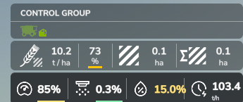
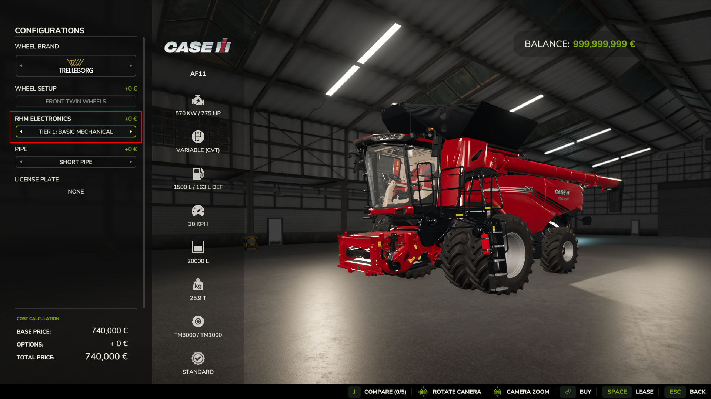
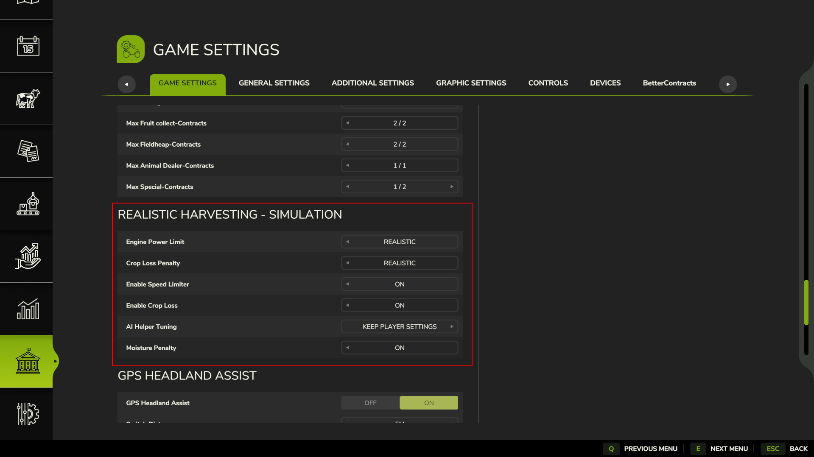
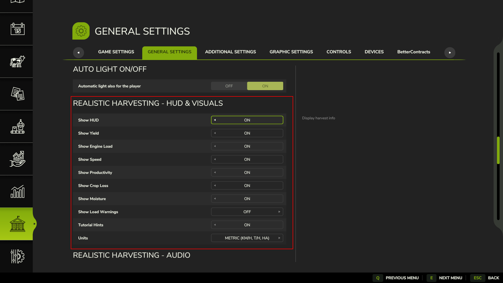
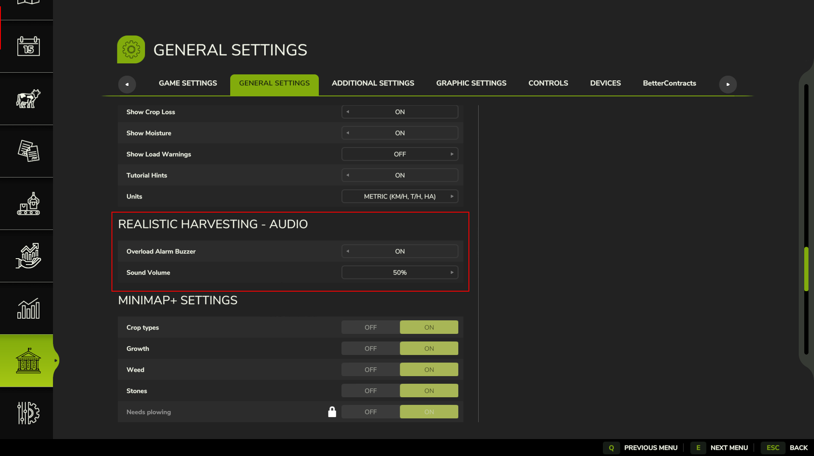

# Realistic Harvesting — Farming Simulator 25

> **"Your combine now behaves like a real, heavy agricultural machine. Push it too hard — and you'll pay the price."**

---

## 📥 Official Download & Links

- 🌐 **Official Download:** **[kingmod.net by exekx](https://www.kingmods.net/en/fs25/mods/73932/realistic-harvesting)**
- 💬 **Community & Support:** [Discord Server](https://discord.gg/Dc2CvZJqU4)
- 🐛 **Bugs & Suggestions:** [GitHub Issues](https://github.com/exekx/FS25_RealisticHarvesting/issues)
- 🌾 **Recommended Integrations:** [Precision Farming (PF)](https://www.farming-simulator.com/mod.php?mod_id=318936) · [Moisture System](https://www.farming-simulator.com/mod.php?mod_id=354130&title=fs2025)

---

## 🌾 Part I: Mod Overview — What & Why?

### The Problem in Vanilla FS25
In the base game of Farming Simulator 25, combines behave like arcade lawnmowers. You can lower a huge 14-meter cutterbar on an underpowered machine, floor cruise control to 10–12 km/h through dense, high-yielding wheat, and harvest without resistance. There are no engine bog-downs, no calibration penalties, no mechanical physics, and zero grain loss.

### The Realistic Harvesting Solution
**Realistic Harvesting** rebuilds combine physics from the ground up. Harvesters now operate under a **first-principles power-balance physical load engine** based on ASABE engineering standards:

$$P_{total} = P_{base} + P_{header}(v) + P_{process} + P_{soil}$$

1. **$P_{base}$ — Parasitic Mechanical Friction (~10% HP):** Driveline drag, hydraulic pumps, and empty rotor/straw chopper inertia.
2. **$P_{header}(v)$ — Cutting & Ingestion Drag:** Power consumption pulled directly from the attached cutterbar's store specs, scaling with cutter width and forward speed ($v$). Putting an oversized header on a small combine drags the machine down to a crawl.
3. **$P_{process}$ — Threshing & Processing Work ($\dot{m} \times E_{spec}$):** Physical energy required to separate grain and chop straw based on incoming mass flow ($\dot{m}$ in tons/hour) and crop-specific energy ($E_{spec}$). Heavy straw cereals take far more horsepower than canola or dry corn.
4. **$P_{soil}$ — Terrain Slope & Soil Rolling Resistance:** Climbing steep hills or working soft, wet ground places authentic mechanical demand on the drivetrain.

If total required power approaches engine capacity, the combine automatically slows down to protect the threshing drum. If you turn off the limiter or push past 95–100% load, **physical grain loss begins spilling behind the machine**, and an in-cabin warning alarm sounds!

*Authentic field operation: the harvester dynamically throttles ground speed based on crop density and live engine load.*

---

### 🌟 Key Feature Highlights

- **Dynamic Speed Limiting & Cruise Control Regulation:** Automatically maintains optimal engine throughput, featuring an intelligent deadband that prevents throttle surging.
- **Hydrostatic Transmission Smoothing & Crop Speed Memory:** Smooth Hermite S-curve entry ramp prevents jerky stops when entering thick stands, and rolling speed memory remembers your working pace across headland turns.
- **Progressive Crop Loss Model:** Safe under 80% load, minimal loss between 80–100%, and steep exponential losses above 100% when separator shoes choke.
- **In-Cabin Warning Buzzer (Audio Alarms):** Electronic warning buzzer alerts you at critical overload (≥98% load) or excessive crop loss (>4.0%), balanced between 1st person cockpit and 3rd person chase camera.
- **4-Tier Shop Electronics Progression:** Upgrade from basic factory mechanical controls to sensors, yield monitors, and Opti-Harvest AI Autopilot.
- **Interactive Touchscreen Calibration Terminal (`Right Shift + K`):** Real-time adjustment of rotor speed, concave clearance, cleaning fan, upper/lower sieves, and target engine load. Can even be opened while AI or Courseplay is driving!
- **AI Helper Protection (`AI Helper Tuning`):** Protect your manually dialed combine settings and custom saved profiles from ever being overwritten by hired workers or Courseplay.
- **Dynamic Map Crop Extraction & Localization:** Scans your active map to only show native crops in your language, with automatic ASABE physics templates for custom modded crops.
- **Zero-Gap Magnetic HUD Docking:** Telemetry HUD automatically docks seamlessly underneath the Precision Farming yield box or the F1 menu.
- **Full In-Game ESC Handbook:** 9 comprehensive tutorial pages localized into 15 languages directly inside the `ESC → In-Game Help` menu.
- **100% Savegame Persistence:** All slider values, chosen crops, and target engine loads are permanently stored in your career savegame XML.

---

## 🎮 Part II: Player's Mini-Guide (How to Play)

### Step 1: Quick Start (Your First 5 Minutes)
1. **Purchase or lease a combine** in the shop and attach a compatible cutterbar.
2. Enter the cabin and lower the header into the crop.
3. The **telemetry HUD** appears automatically in the top-left corner, magnetically docked under Precision Farming or the F1 help box.
4. **Watch the Engine Load indicator:**
   - 🟢 **Under 80% (Green):** Optimal safe zone — **0.0% crop loss**.
   - 🟡 **80% – 95% (Yellow):** High throughput — minor operational losses (~0.5–2%).
   - 🔴 **Above 95% (Red Alert):** Critical overload! The machine will slow down. Pushing past **98%** triggers the in-cabin alarm buzzer.
5. Press **Right Shift + K** at any time to open the **Calibration Terminal** and tune your machine.
6. Press **Right Shift + H** at any time to toggle the telemetry HUD overlay on or off.

---

### Step 2: Reading the Telemetry HUD

The sleek horizontal HUD bar gives you instant, non-intrusive feedback:

| Icon | Metric | Meaning & In-Game Behavior |
|:---:|:---|:---|
|  | **Engine Load %** | Current machine strain (0–100%+). Underlined with a real-time mechanical stress bar (white → yellow → orange → pulsing red alert). 🟢 Safe under 80%, 🟡 Warning at 80–95%, 🔴 Overload above 95%. |
|  | **Crop Loss %** | Live percentage of lost grain escaping separation or blown over the cleaning shoe. 🟢 Low (<1%), 🟡 Medium (1–4%), 🔴 Critical (>4%). |
|  | **Crop Moisture %** | Real-time crop & straw moisture content (active on Tier 3+ combines with [Moisture System](https://www.farming-simulator.com/mod.php?mod_id=354130&title=fs2025)). Damp crops increase engine resistance. |
|  | **Productivity** | Live processing throughput rate over time (`t/h`, `ton/h`, `bu/h`, or `L/h`). |
|  | **Field Yield** | Instantaneous crop yield sampled in real time from the cut field swath (`t/ha`, `ton/ac`, `bu/ac`). |
|  | **Speed / Target** | Current forward ground speed alongside the dynamically calculated safe speed limit. |
|  | **Calibration Terminal** | Quick-access indicator for the touchscreen calibration menu (**Right Shift + K**). |

> 💡 **Repositioning the HUD:** Press **Right Shift + K** to unlock the mouse cursor. Click and drag the HUD to any custom position on your monitor. When docked, it automatically tracks Precision Farming or F1 menu changes.

---

### Step 3: Understanding Crop Loss & Audio Alarms

Grain losses occur from two primary sources:

1. **Overload Losses (Driving Too Fast / Excessive Mass Flow):**
   - **0% to 80% Load:** Safe operating zone — **0.0% crop loss**.
   - **80% to 100% Load:** Progressive capacity boundary — minor loss (~0.1% to 2.0%).
   - **100% to 110% Load:** High throughput territory — moderate loss (~2.0% to 4.5%).
   - **Above 110% Load:** Severe choking of threshing drum and sieves — exponential losses (up to 50%).
2. **Calibration Losses (Misaligned Machine Settings):**
   - **Rotor Speed / Concave Clearance:** Poor threshing either leaves grain in the ear or overworks the engine (`Efficiency -%`). Proper calibration yields up to a **+5.0% Speed Bonus**.
   - **Fan Speed & Sieves:** Excessive fan air blows clean grain out the rear; weak fan air clogs the cleaning shoe with chaff.
3. **In-Cabin Overload Buzzer:**
   - Sounds automatically inside the cockpit whenever **Engine Load ≥ 98%** or **Crop Loss > 4.0%**.
   - Balanced with automated exterior volume boost (+25%) when using 3rd person chase camera. Volume and toggle can be configured in `ESC → General Settings → Realistic Harvesting - Audio`.

---

### Step 4: Machine Shop Progression (RHM Electronics Tiers)

When buying or leasing equipment, select an **RHM Electronics** package to match your farm's budget:

| Tier | Package Name | Price | Player Manual Driving | AI Worker & Courseplay Auto-Tuning |
|:---:|:---|:---:|:---|:---|
| **1** | **Basic Mechanical** | Free | Base physics & auto-limiter. Factory baseline variance (~50% ± 8%). Strictly manual control. | **±18% setting variance** (inexperienced helper; higher losses and lower field speed). |
| **2** | **Sensor Kit** | $3,500 | Adds live Yield (`t/ha`), Productivity (`t/h`), and green optimal target guides on sliders. | **±10% setting variance** (moderate competence). |
| **3** | **Yield & Loss Monitor** | $8,500 | Adds live Crop Loss %, Moisture telemetry, and **custom crop profile saving**. | **±4% setting variance** (experienced operator; near zero loss). |
| **4** | **Opti-Harvest AI** | $15,000 | Unlocks the **`AI AUTO-CALIB`** one-click calibration button + continuous live dynamic auto-trimming. | **0% flawless factory settings** + continuous live micro-trimming during harvest! |

> 📌 **Contract Machinery:** Leased equipment for contracts always spawns in the baseline configuration (**Tier 1 Basic Mechanical**). Invest in your farm's own fleet to unlock monitors and Opti-Harvest AI!

---

### Step 5: The Calibration Terminal (`Right Shift + K`)

Open the interactive terminal at any time (even while an AI worker or Courseplay is actively harvesting):

| Well-Calibrated Combine (Tier 4 / Profile) | Uncalibrated Baseline (Factory Fresh) |
|:---:|:---:|
|  |  |
| *Zero loss (0.0%), maximum efficiency, optimal green bars* | *High predicted loss (9.1%), negative efficiency (-6.2%)* |

#### Parameters Explained:
- **Top Telemetry Cards:**
  - `ENGINE LOAD`: Live mechanical strain on the engine.
  - `EFFICIENCY`: Separation efficiency (+5% bonus when optimal; negative efficiency costs engine power).
  - `PREDICTED LOSS`: Expected cleaning shoe grain loss with current fan and sieve settings.
- **SEPARATION:**
  - `Rotor Speed`: Threshing drum speed (RPM). High for small wet grains; lower for corn and sunflowers.
  - `Concave Clearance`: Distance between threshing cylinder and concave (mm).
- **CLEANING:**
  - `Fan Speed`: Blower air volume (RPM) separating chaff from seed.
  - `Upper Sieve` & `Lower Sieve`: Chaffer and sieve openings (mm).
- **PERFORMANCE:**
  - `Target Engine Load`: Setpoint for cruise control throttling (default: **88%**).
- **Profile Controls:**
  - `SAVE PROFILE`: Saves current settings for the active crop.
  - `LOAD PRESET`: Loads your previously saved profile.
  - `RESET TO FACTORY DEFAULTS`: Restores factory baseline.
  - `AI AUTO-CALIB`: Unlocked on Tier 4. Harvest 5–10 meters in the field to gather stream telemetry, open Shift+K, and click for instant zero-loss calibration!

---

### Step 6: AI Workers & Courseplay Integration

Hired hands and Courseplay drivers interact realistically with your combine's electronics:

- **Protecting Your Settings (`AI Helper Tuning`):**
  - Go to `ESC → Game Settings → Realistic Harvesting - Simulation`.
  - Set **AI Helper Tuning** to **`Keep Player Settings`**.
  - Now, hired helpers and Courseplay will **never overwrite** your manually tuned sliders or saved profiles!
- **Automated AI Tuning (`Always Auto-Tune`):**
  - When enabled, helpers automatically tune the combine based on the installed Electronics Tier (Tier 1: ±18%, Tier 2: ±10%, Tier 3: ±4%, Tier 4: 0% optimal).
- **On-the-Fly Terminal Inspection:**
  - Press **Right Shift + K** while Courseplay or an AI worker is driving to inspect live load and losses, or manually fine-tune settings without stopping work.

---

### Step 7: Mod Configuration (`ESC` Menu)

Settings are organized across game menus:

#### ⚙️ Simulation Settings (`ESC → Game Settings` — Server & Host Controlled)

| Setting | Options | Description |
|:---|:---:|:---|
| **Engine Power Limit** | Arcade (200%) / Normal (120%) / Realistic (100%) | Scales combine processing capacity |
| **Crop Loss Penalty** | Arcade (50%) / Normal (100%) / Realistic (200%) | Scales overload and calibration crop losses |
| **Enable Speed Limiter** | ON / OFF | Automatically regulates cruise control to protect the threshing drum |
| **Enable Crop Loss** | ON / OFF | Enables or disables physical grain loss spilling onto the ground |
| **AI Helper Tuning** | Keep Player Settings / Always Auto-Tune / Disabled | Controls helper calibration behavior |
| **Moisture Penalty** | ON / OFF | Enables dynamic moisture load penalties when Moisture System is active |

#### 📊 HUD & Visuals Settings (`ESC → General Settings` — Personal per Player)

| Setting | Options | Description |
|:---|:---:|:---|
| **Show HUD** | ON / OFF | Master toggle for the telemetry HUD panel |
| **HUD Metric Toggles** | ON / OFF | Toggle Yield, Engine Load, Speed, Productivity, Loss, Moisture, and Load Warnings |
| **Tutorial Hints** | ON / OFF | Contextual on-screen onboarding banners and tips |
| **Units** | Metric / Imperial / Bushels | Measurement systems: Metric (`km/h, t/ha, t/h`), Imperial (`mph, ton/ac, ton/h`), Bushels (`mph, bu/ac, bu/h`) |

#### 🔊 Audio Settings (`ESC → General Settings` — Personal per Player)

| Setting | Options | Description |
|:---|:---:|:---|
| **Overload Alarm Buzzer** | ON / OFF | Toggles in-cabin buzzer during critical overload (≥98%) or excessive loss (>4%) |
| **Sound Volume** | 50% – 150% | Adjusts warning alarm master volume with intelligent camera balance |

---

### Step 8: Pro Harvesting Tips

1. **Conquering Steep Hills:** Climbing hills draws significant wheel torque from the engine. On steep terrain, lower your **Target Engine Load** to **80–84%** in the Shift+K menu to provide an engine power buffer and prevent sudden stops.
2. **Moisture Matters:** Harvesting during morning dew or damp weather increases threshing resistance by 20–35%. Whenever possible, harvest grain during dry afternoon hours.
3. **Save Profiles for Your Fleet:** Once you dial in the perfect settings for wheat or canola on your farm, hit **SAVE PROFILE**. Any combine of the same class in your fleet can load those settings instantly.
4. **Smooth Headland Turns:** When lifting the cutterbar at field edges, the combine's **Crop Speed Memory** remembers your working speed, allowing seamless row re-entry without harsh braking.

---

## 🌾 Part III: Supported Machine Types & Reference Settings

Optimal settings are calculated dynamically by the mod's physical engine based on seed geometry and live moisture. Below are reference operational guidelines:

### 🌾 Grain Combines — 5 Parameters
*(Fan Speed · Rotor Speed · Upper Sieve · Lower Sieve · Concave Clearance)*

| Crop | Fan Speed (RPM) | Rotor Speed (RPM) | Upper Sieve (mm) | Lower Sieve (mm) | Concave Clearance (mm) |
|:---|:---:|:---:|:---:|:---:|:---:|
| **Wheat / Barley** | 940–1070 | 870–970 | 15–18 | 10–13 | 4–8 |
| **Oat** | 940–1070 | 820–930 | 18–21 | 12–15 | 5–9 |
| **Corn (Maize)** | 1070–1180 | 470–560 | 21–24 | 15–18 | 25–35 |
| **Soybean / Pea / Legumes** | 910–1040 | 640–750 | 15–18 | 10–13 | 15–21 |
| **Canola (Rapeseed)** | 880–980 | 600–700 | 14–16 | 9–11 | 18–22 |
| **Sunflower** | 870–990 | 440–530 | 19–23 | 14–17 | 25–35 |
| **Rice** | 960–1080 | 910–1020 | 19–23 | 16–19 | 4–8 |
| **Sorghum** | 940–1070 | 720–830 | 15–18 | 11–14 | 4–8 |
| **Lentil / Chickpea** | 960–1200 | 520–610 | 18–24 | 12–16 | 15–21 |

---

### 🌿 Forage Harvesters — 3 Parameters
*(Blower Speed · Chopping Drum · Feed Rolls)*

| Crop | Blower Speed (RPM) | Chopping Drum (RPM) | Feed Rolls (RPM) |
|:---|:---:|:---:|:---:|
| **Grass / Dry Grass (Hay)** | 1150–1290 | 1110–1150 | 380–460 |
| **Corn Silage (Chaff)** | 1220–1360 | 1140–1180 | 440–520 |

---

### 🥔 Root & Vegetable Harvesters — 3 Parameters
*(Fan Speed · Cleaning Rollers · Elevator Web)*

| Crop | Fan Speed (optimal) | Cleaning Rollers (optimal) | Elevator Web (optimal) | Notes |
|:---|:---:|:---:|:---:|:---|
| **Potato** | **610 RPM** | **200 RPM** | **310 RPM** | Gentle rollers prevent tuber bruising |
| **Sugarbeet** | **640 RPM** | **240 RPM** | **300 RPM** | Higher cleaning intensity |
| **Beetroot** | **630 RPM** | **220 RPM** | **300 RPM** | Intermediate cleaning balance |
| **Onion** | **850 RPM** ⬆️ | **210 RPM** | **270 RPM** | High airflow separates dry skins and leaves |
| **Carrot / Parsnip** | **580 RPM** | **190 RPM** | **330 RPM** ⬆️ | High-speed elevator lifts heavy soil web |
| **Spinach** | **520 RPM** ⬇️ | **160 RPM** ⬇️ | **280 RPM** | Delicate leaves tear easily; low air |
| **Green Bean** | **670 RPM** | **200 RPM** | **290 RPM** | Rotary stripper drum speed balance |

---

### 🪡 Cotton Pickers — 3 Parameters
*(Fan Speed · Picker Speed · Feeder Speed)*

| Parameter | Optimal | Zero Loss Zone |
|:---|:---:|:---|
| **Fan Speed (RPM)** | 3250 | 3100–3400 |
| **Picker Speed (RPM)** | 210 | 200–220 |
| **Feeder Speed (RPM)** | 190 | 170–210 |

---

## 🔗 Part IV: Ecosystem & Mod Compatibility

- **[Precision Farming (PF)](https://www.farming-simulator.com/mod.php?mod_id=318936):** Native dynamic yield scaling across variable soil types and nitrogen zones. Includes zero-gap magnetic HUD docking beneath the PF yield box.
- **[Moisture System](https://www.farming-simulator.com/mod.php?mod_id=354130&title=fs2025):** Live HUD moisture tracking, dynamic wet crop load resistance, and separation penalties.
- **Swathing / Windrow Pickups:** Automatically detected; cutterbar knife drag ($P_{header}$) drops to zero, computing power purely from intake volume.
- **Modular Platforms (NEXAT):** Full vehicle hierarchy search resolves the true engine horsepower across modular gantry carriers and attachments.
- **Interactive Control & HeadTracking:** Includes conflict mediators preventing camera lock or frozen mouse clicks while in the Shift+K calibration menu.

---

## ❓ Frequently Asked Questions (FAQ)

**Q: My combine slows down automatically in dense spots. Is that normal?**  
Yes! If the Speed Limiter is active, the cruise control automatically down-throttles to prevent the threshing drum from plugging and avoid grain loss.

**Q: Why do my combine sliders start at ~50% when purchased?**  
Real machines arrive from the factory in a neutral transport baseline (~50% ± 8%). On Tiers 1–3, tune them manually or load a profile; on Tier 4, click **AI AUTO-CALIB**.

**Q: How does the in-cabin alarm buzzer work?**  
An audible warning sounds inside the cabin whenever **Engine Load reaches 98%+** or **Crop Loss exceeds 4.0%**. You can adjust its volume or turn it off in `ESC → General Settings → Realistic Harvesting - Audio`.

**Q: Can I open the calibration menu while Courseplay or an AI worker is driving?**  
Yes! Press **Right Shift + K** at any time to monitor telemetry or adjust sliders on the fly.

**Q: How do I prevent AI helpers from overwriting my settings?**  
In `ESC → Game Settings → Realistic Harvesting - Simulation`, set **AI Helper Tuning** to **`Keep Player Settings`**.

**Q: How does the HUD dock with Precision Farming?**  
It magnetically snaps directly beneath the Precision Farming yield box with zero gap, smoothly adapting whenever menus toggle. You can also press **Right Shift + K** and drag it anywhere.

**Q: Where can I find in-game help?**  
Open `ESC → In-Game Help` to read the built-in 9-page handbook translated into 15 languages!

---

## 💾 Installation

1. Download the latest release from **[kingmod.net](https://www.kingmods.net/en/fs25/mods/73932/realistic-harvesting)**
2. Place `FS25_RealisticHarvesting.zip` into your `mods` folder:
   - Typically: `Documents/My Games/FarmingSimulator2025/mods/`
3. Activate the mod in the in-game Modhub / Mod selection screen.

---

## 👥 Credits & Support

**Created by:** exekx

- **Official Download:** [kingmod.net](https://www.kingmods.net/en/fs25/mods/73932/realistic-harvesting)
- **Community & Support:** [Discord Server](https://discord.gg/Dc2CvZJqU4)
- **Bugs & Suggestions:** [GitHub Issues](https://github.com/exekx/FS25_RealisticHarvesting/issues)

**Made with ❤️ for the FS25 Harvesting Community**

